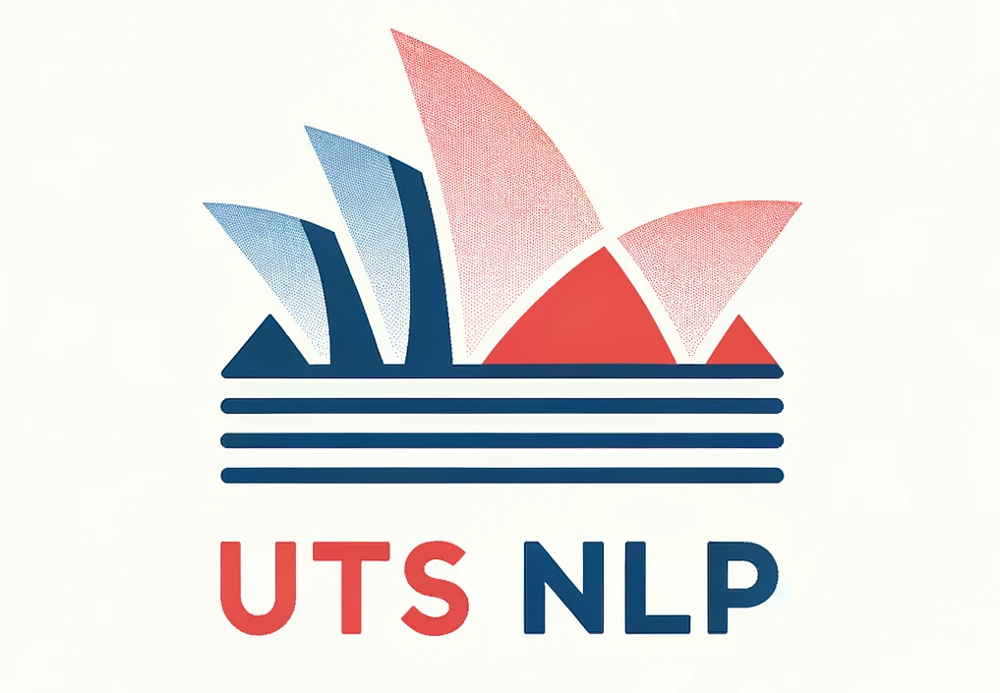

# UTS NLP Research Group Website

This is the website of our academic research group at the [University of Technology Sydney](https://www.uts.edu.au/). You can access our research group at [utsnlp.github.io](https://utsnlp.github.io/)

<p align=center>
    
</p>

The website template is powered by [Jekyll](https://jekyllrb.com/) and is easy to use. You don't need much front-end knowledge to maintain the website. You can update information by only writing `markdown` and `yml` files.

## How to Maintain the Website

### Update Locally

If you want to make changes of the website and test it locally first, you need to install necessary environment. 

First, clone this repository: 

```bash
git clone https://github.com/utsnlp/utsnlp.github.io.git
cd utsnlp.github.io
```

Then checkout to the `dev` branch, we recommend to do changes and test it on this branch before merging to the `main` branch:

```bash
git checkout dev
```

This website is powered by [Jekyll](https://jekyllrb.com/), install Jekyll and its prerequisites (e.g., Ruby, GEM) by following the [doc](https://jekyllrb.com/docs/). 
Then, in the project folder, run 

```bash
bundle exec jekyll serve
```

Open your browser and review the website at: http://localhost:4000. 
When the server is running, make your changes and refresh the website to review the changes.
Once you have finished updating, commit your changes and push them to Github on `dev` branch.

Raise a **pull request** and merge from `dev` to `main`. Github [actions](https://github.com/utsnlp/utsnlp.github.io/actions) will take care of the deployment. Now you can review the live site [utsnlp.github.io](https://utsnlp.github.io/).


### Update Directly

If you don't want to install the local environment, you can directly make changes by updating the **.md** or **.yml** files (see below), pushing the commits to Github, and reviewing the changes online. Note that, this will directly update the live site.


## Where to Maintain the Website

### Update Information

If you only want to update information (e.g., add recent news, add new publications) without modifying the website structure, you can update relevant information by following the below table.

| What to update             | Where to update             |
| :------------------------- | :-------------------------- |
| home page text & images    | `_pages/home.md`            |
| news                       | `_data/news.yml`            |
| team member info - faculty | `_data/faculty_members.yml` |
| team member info - phd     | `_data/phd_students.yml`    |
| team member info - master  | `_data/master_students.yml` |
| team member info - alumni  | `_data/alumni_members.yml`  |
| publications               | `_data/publist.yml`         |
| projects                   | `_data/projects.yml`        |
| vacancies                  | `_pages/openings.md`        |


### Update Website Structure

Instead, If you want to change the website structure (e.g., rearrange image position, team member display, etc.), you can go through the following files and update them.

| What to update | Where to update                                  |
| :------------- | :----------------------------------------------- |
| home page      | `_layouts/default.html`, `_layouts/homelay.html` |
| news           | `_pages/allnews.md`, `_includes/news.html`       |
| team           | `_pages/team.md`                                 |
| publications   | `_pages/publications.md`                         |
| projects       | `_pages/projects.md`                             |
| header         | `_includes/header.html`                          |
| footer         | `_includes/footer.html`                          |

## Acknowledgement

This website template is adapted from [Allan Lab](http://www.allanlab.org/aboutwebsite.html). 
Thanks for open-sourcing the template.
